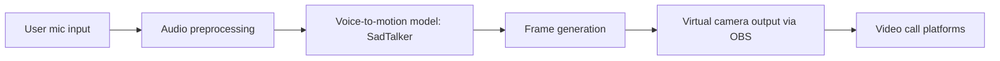

# Mimika-AI
**Многофункциональная платформа для создания и применения цифровых аватаров на базе ИИ**


Mimika AI — это проект по созданию реалистичных цифровых аватаров, синхронизированных с голосом пользователя. Наши решения позволяют использовать этих аватаров в различных сценариях: от видеозвонков и онлайн-обучения до цифровых ассистентов и виртуального присутствия. Мы разрабатываем мультимодальную систему, сочетающую генерацию речи, лицевую анимацию и рендеринг, чтобы пользователь мог взаимодействовать в онлайне без необходимости показывать себя в кадре. 

## 🧩 Ключевые возможности

- 🎤 Генерация лицевой анимации по аудиопотоку
- 🧠 Интеллектуальный pipeline: от анализа речи до рендеринга видео
- 💻 Вывод через виртуальную камеру (OBS) в Zoom, Meet и т.д.
- 🖌️ Индивидуальный стиль: можно настроить внешний вид и мимику
- ⚙️ Гибкая архитектура — легко адаптируется под новые модели

---

## 🔧 Как это работает?

1. **Speech-to-animation pipeline**: аудиопоток пользователя поступает в модуль распознавания и анализа речи.
2. **Липсинк и генерация видео**: аудио преобразуется в последовательность движений лица и губ, используя предварительно обученные модели 
3. **Отображение аватара**: сгенерированное видео подаётся в виртуальную камеру через OBS, которая подключается к Zoom, Телемост, Meet и другим платформам.

---

## 🧠 Архитектура



---

## 📁 Структура проекта

```
Mimika-AI/
├── README.md
├── demo/
│   └── example_avatar_video.mp4
├── notebooks/
│   └── demo_pipeline.ipynb
├── src/
│   ├── inference.py
│   ├── audio_to_motion.py
│   ├── video_renderer.py
│   └── virtual_camera.py
├── models/
│   └── lipsync_model_stub.py
├── assets/
│   ├── avatar_samples/
│   └── logo.png
└── requirements.txt
```

---

## 🚀 Быстрый старт

```bash
git clone https://github.com/mimika-ai/mimika-ai.git
cd mimika-ai
pip install -r requirements.txt
python src/inference.py --audio demo/audio_sample.wav --avatar assets/avatar_samples/avatar1.png
```


---

## 📅 Roadmap

- [x] Заглушка под lip-sync модель
- [x] Интеграция с OBS
- [ ] Обработка пользовательского аудио в реальном времени
- [ ] Поддержка выбора аватара через UI
- [ ] MVP web-интерфейса для создания аватара

---


## 🤝 Контакты

Разработка: icon-ai.tech@yandex.ru
Москва, Россия
